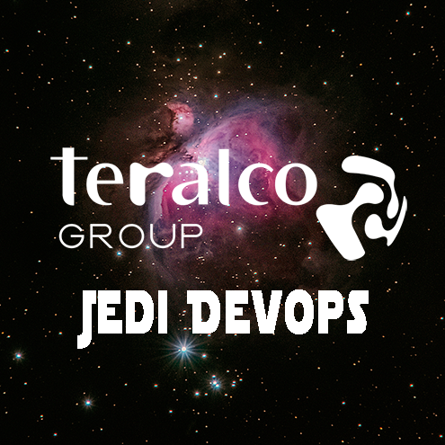

# Jedi DevOps: El challenge de un Devops Épico

¡Bienvenido, joven padawan, al changellenge donde te convertiras en un Jedi devops! Aquí encontrarás los pasos que esperemos que puedas superar para convertirte en un maestro de las galaxias en el arte de la integración y despliegue continuo.

  

## Paso 1: Despliega tus poderes con una rama nueva

Primero, crea una rama develop desde la rama principal (main). ¡Que la Fuerza te acompañe!

## Paso 2: Enfrenta la prueba de la PR

Crea una Pull Request desde develop a main y prepárate para el combate. ¡Es hora de demostrar tu valía!

## Paso 3: Confronta los Quality Gates de Sonar

¡Una batalla crucial! Debes crear un workflow para pasar el codigo por Sonar.

- Si los Quality Gates no se cumplen, prepárate para el combate y declina la PR con el poder de la API.
- Si los Quality Gates son superados, aprueba la PR y crea una tarea en Jira.

## Paso 4: Desata el poder del merge y cierra la tarea

Cuando la PR sea fusionada manualmente, desencadena el flujo que llevará tu aplicación a nuevas alturas. Que el código fluya como la Fuerza misma. No olvides cerrar la tarea correspondiente en JIRA para sellar tu victoria y equilibrar la Fuerza y la gestión de proyectos en un solo movimiento.

¡Y así, nobles guerreros, os convertiréis en verdaderos maestros Jédai del DevOps! Que la Fuerza del Código os acompañe en cada paso de vuestro viaje.

